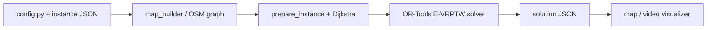

# EVRP — Electric Vehicle Routing Problem with Time Windows

Hệ thống tối ưu lộ trình xe tải điện giao hàng trên tại khu vực Cầu Giấy, Hà Nội. Solver dùng Google OR-Tools, có ràng buộc tải trọng, khung giờ giao nhận, pin/SoC và trạm sạc VinFast.


https://github.com/user-attachments/assets/97ccf0a1-629a-4036-a09e-f7f9c21a8f4c


## Tính năng

- Tải và xử lý đồ thị đường OSM
- Ma trận khoảng cách / thời gian thật giữa depot, khách hàng và trạm sạc
- Giải E-VRPTW bằng OR-Tools (Guided Local Search)
- Xuất lời giải JSON (lộ trình, pin, tải, thời gian)
- Visualize bản đồ và video MP4 mô phỏng lộ trình

## Cấu trúc dự án

```
EVRP/
├── config.py                 # Cấu hình kho hàng, trạm sạc, thông số xe & hệ thống
├── requirements.txt
├── data/
│   ├── instances/            # Input: file instance JSON
│   ├── processed/            # Graph OSM, ma trận khoảng cách
│   └── output/               # Solution JSON, video
└── src/
    ├── mapping/
    │   ├── map_builder.py        # Tải OSM graph Cầu Giấy
    │   ├── map_visualizer.py     # Preview bản đồ
    │   └── video_visualizer.py   # Animation MP4 lời giải
    └── routing/
        ├── prepare_instance.py   # Snap tọa độ + build distance matrix
        ├── shortest_path.py      # Dijkstra trên OSM graph
        ├── solver.py             # OR-Tools E-VRPTW
        ├── runner.py             # Chạy pipeline giải
        └── exporter.py           # Xuất solution JSON
```

## Yêu cầu

- Python 3.10+

## Cài đặt

```bash
python -m venv .venv

# Windows
.venv\Scripts\activate

# macOS / Linux
source .venv/bin/activate

pip install -r requirements.txt
```

## Định dạng instance

Tạo file `data/instances/<ten>.json`:

```json
{
  "instance_name": "sample_01",
  "num_vehicles": 5,
  "customers": [
    {
      "id": "C1",
      "lat": 21.03,
      "lon": 105.79,
      "demand_kg": 50,
      "tw_open": 540,
      "tw_close": 720,
      "service_time_min": 10
    }
  ]
}
```

- `tw_open` / `tw_close`: time window
- `demand_kg`: lượng hàng cần giao(kg)
- Depot và trạm sạc lấy từ `config.py`

## Cách chạy

Các lệnh dưới đây chạy từ **thư mục gốc** dự án.

### 1. Build bản đồ OSM

```bash
python src/mapping/map_builder.py
```

Lưu graph vào `data/processed/cau_giay_graph.pkl`.

### 2. Chuẩn bị ma trận khoảng cách

```bash
python src/routing/prepare_instance.py --instance sample_01
```

Sinh `data/processed/matrix_sample_01.pkl`

### 3. Giải bài toán

```bash
python src/routing/runner.py sample_01
```

Xuất `data/output/solution_sample_01.json` với tóm tắt:

- Số xe sử dụng
- Tổng quãng đường (km)
- Thời gian sạc (phút)
- Năng lượng tiêu thụ (kWh)

### 4. Visualize

```bash
# Preview bản đồ + trạm sạc
python src/mapping/map_visualizer.py

# Video mô phỏng lộ trình
python src/mapping/video_visualizer.py --instance sample_01 --fps 15 --speed 300
```

## Pipeline tổng quan



## Ràng buộc solver

- **Capacity**: tổng demand trên route ≤ `max_load_kg`
- **Time windows**: đến phục vụ trong khung giờ từng node
- **Battery / SoC**: quy định không được xuống quá mức an toàn
- **Depot**: xe xuất phát / kết thúc tại depot trong cửa sổ hoạt động
